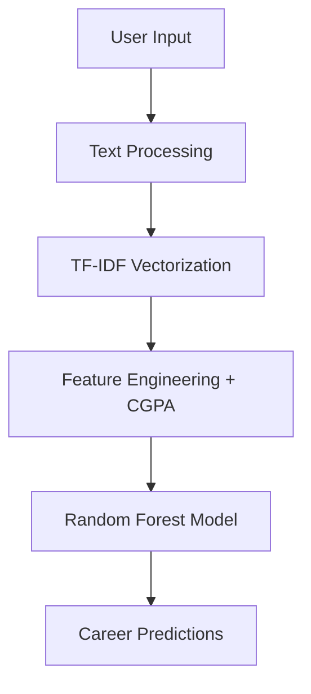

# 🎯 Smart Career Advisor  


---

## 🚀 Overview  

**Smart Career Advisor** is an AI-powered web application that helps users:  

✔️ Discover the best career paths  
✔️ Analyze resumes with ATS scoring  
✔️ Identify missing skills  
✔️ Get personalized career insights  

Built using **Machine Learning + Streamlit UI**, this project transforms raw user data into actionable career guidance.

---

## ✨ Key Features  

### 🎯 Career Prediction  
- ML-based predictions using **Random Forest**
- Trained on **1,195+ real graduate profiles**
- Outputs:
  - 🥇 Top career matches  
  - 📊 Confidence scores  
  - 🧠 Skill gap analysis  
  - 💡 Career tips  

---

### 📄 Resume ATS Analyzer  
- Upload resume (PDF / DOCX / TXT)  
- Get detailed insights:
  - ✅ ATS Score (0–100)  
  - 📊 Skill Match %  
  - 📈 Job Description Match  
  - 📋 Resume structure checks  
  - 🔑 Keyword detection  

---

### 🎨 Modern UI  
- Clean & responsive design  
- Interactive dashboards  
- Easy-to-use interface  

---

## 🧠 Machine Learning Pipeline  


---

## 🧠 Tech Stack

- **Frontend**: Streamlit  
- **Backend**: Python  
- **Machine Learning**: Scikit-learn (Random Forest)  
- **Data Processing**: Pandas, NumPy  
- **NLP**: TF-IDF Vectorizer  
- **Resume Parsing**:  
  - pdfplumber  
  - PyPDF2  
  - python-docx  

---

## 📂 Project Structure
```
smart-career-advisor/
│── app.py
│── career_recommender.csv
│── requirements.txt
│── README.md
```

---

## ⚙️ Installation

### 1️⃣ Clone the repository
```bash
git clone https://github.com/your-username/career-advisor.git
cd career-advisor
```
### 2️⃣Create virtual environment
```bash
python -m venv venv
venv\Scripts\activate   # Windows
```
### 3️⃣ Install dependencies
```bash
pip install -r requirements.txt
```
### 4️⃣ Run the app
```bash
streamlit run app.py
```

### 📌 Usage
- Open the app in browser
- Enter your:
  -Course
  -Skills
  -Interests
- Click "Get Career Predictions"

OR

- Upload your resume to:
   -Get ATS score
   -Improve your resume

